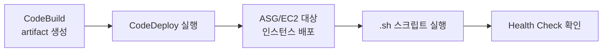
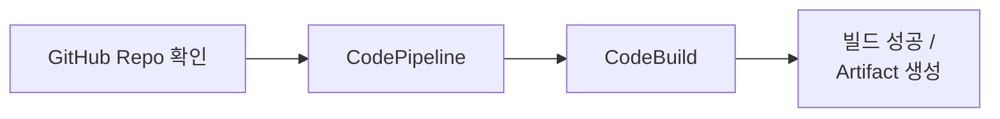
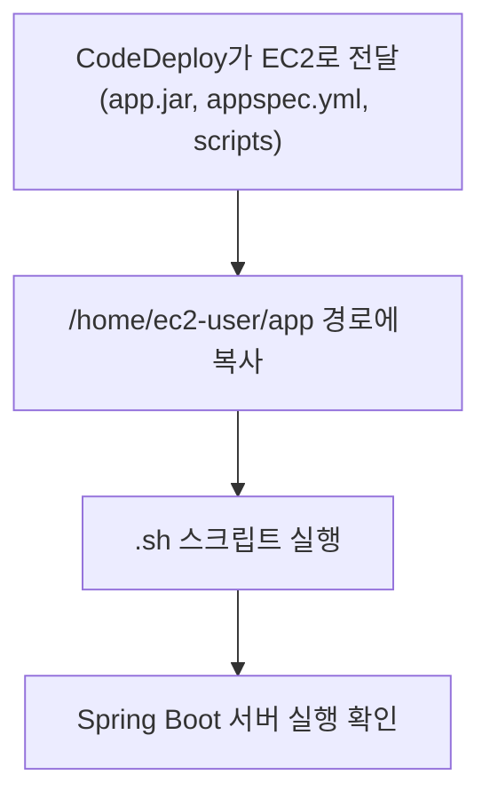
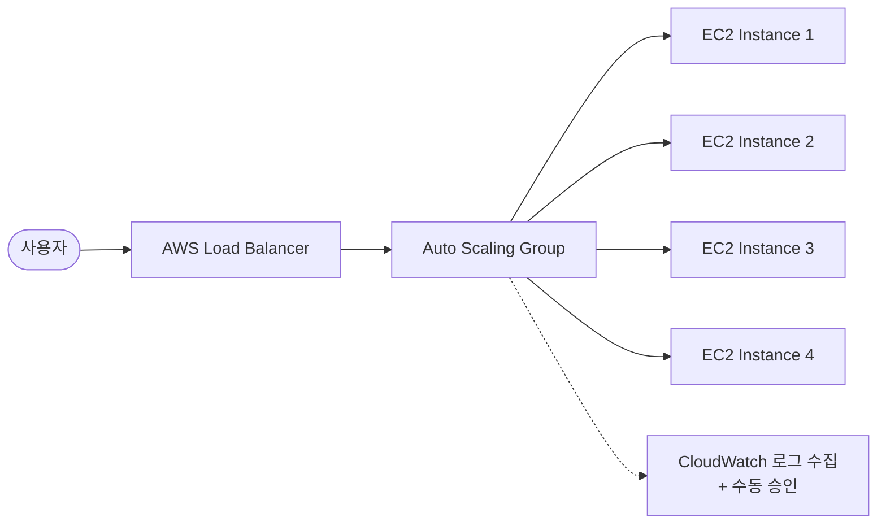
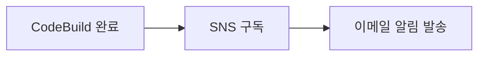
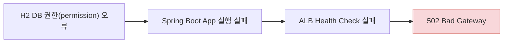
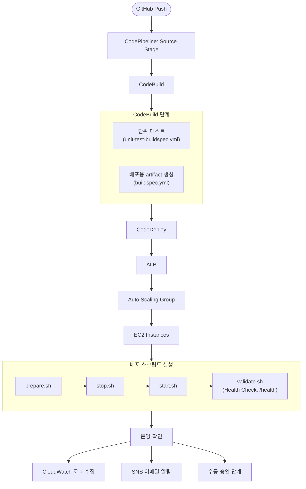

# 웹 서비스를 위한 CI/CD 환경 구현

> KT AIVLE School AI 트랙 미니프로젝트 6차

---

## 목차

1. [시나리오 정립 및 아키텍처 설계](#1-시나리오-정립-및-아키텍처-설계)
2. [CI 환경 구축: CodePipeline & CodeBuild](#2-ci-환경-구축-codepipeline--codebuild)
3. [CD 환경 구축: CodeDeploy 연동 및 배포 자동화](#3-cd-환경-구축-codedeploy-연동-및-배포-자동화)
4. [운영 인프라 확장: ALB, Auto Scaling Group](#4-운영-인프라-확장-alb-auto-scaling-group)
5. [모니터링: CloudWatch + SNS 기반 운영 확인](#5-모니터링-cloudwatch--sns-기반-운영-확인)
6. [이메일 수동 승인](#6-이메일-수동-승인)
7. [트러블슈팅](#7-트러블슈팅)
8. [일자별 결과물 요약](#8-일자별-결과물-요약)

---

## 1. 시나리오 정립 및 아키텍처 설계

| 구분 | 내용 |
|---|---|
| **대상 서비스** | 도서관리 시스템 Backend |
| **목표** | 코드 변경 후 자동 빌드 · 자동 배포 |
| **주요 AWS 서비스** | CodePipeline, CodeBuild, CodeDeploy, EC2, ASG(Auto Scaling Group), ALB, CloudWatch |
| **최종 흐름** | GitHub Push → Build → Deploy → 운영 확인 |
| **추가 기능** | SNS 구독, 수동 승인 이메일 검토 |

- 미니프로젝트 5차에서 구현했던 **도서관리 시스템 Backend Repo**를 기반으로, 해당 저장소에 `buildspec.yml`을 생성하여 CI/CD 파이프라인 구축을 시작함.

### 배포 전략 — Rolling (In-place) 배포

- **방식**: 새로운 서버·인프라를 추가로 생성하지 않고, 현재 운영 중인 기존 서버에서 애플리케이션을 일시 중지한 뒤 새 버전으로 교체하는 배포 방식
- **적용 기술**: CodeDeploy 기반 In-place 배포, 배포 구성은 `CodeDeployDefault.AllAtOnce` 사용
- **동작**: 대상 EC2 또는 Auto Scaling Group 인스턴스에 새 `app.jar`를 동시에 배포하고, 배포 후 Health Check로 정상 동작 확인

**배포 파이프라인 흐름**

**전략 선정 이유**
1. 실습 프로젝트 규모가 작고 배포 대상이 제한적이었음
2. CI/CD 전체 흐름 검증이 핵심 목표였음
3. 수동 승인과 Health Check로 최소한의 안정성 장치를 마련함

---

## 2. CI 환경 구축: CodePipeline & CodeBuild

**목표**: GitHub에 코드가 올라오면 자동으로 빌드가 실행되도록 구성

### 파이프라인 흐름

### 진행 작업
- 도서관리 시스템 Backend Repo 선정
- GitHub Repository 생성 및 코드 연결
- CodePipeline Source Stage 구성
- CodeBuild를 통한 테스트 및 빌드 자동화

### CodeBuild 단계 구성 (Build Stage: `Team-14-test`)
| 빌드 단계 | 역할 |
|---|---|
| **CodeBuild 1** | 단위 테스트 실행 — `unit-test-buildspec.yml` 기반 검증 |
| **CodeBuild 2** | 배포용 `.jar` 파일 생성 — `buildspec.yml` 기반 artifact 생성 |

---

## 3. CD 환경 구축: CodeDeploy 연동 및 배포 자동화

**목표**: CodeBuild에서 생성된 Artifact를 실제 EC2 서버에 배포

### 배포 흐름

### 진행 작업
- 배포 방식 및 배포 전략 논의
- EC2 배포 환경 구성
- CodeDeploy Application / Deployment Group 생성
- `appspec.yml` 작성
- 라이프사이클 훅 스크립트(`stop.sh`, `prepare.sh`, `start.sh`, `validate.sh`) 작성
- `/home/ec2-user/app` 경로 배포 확인
- Spring Boot 서버 실행 및 Health Check 확인

### 배포 스크립트(.sh) 역할

| 스크립트 | 역할 |
|---|---|
| **stop.sh** | 기존 `app.jar` 프로세스 종료 |
| **prepare.sh** | 배포 경로 정리 및 권한 설정 |
| **start.sh** | 새 `app.jar` 실행 및 로그 저장 |
| **validate.sh** | `/health` API로 서비스 정상 여부 확인 |

### 검증 결과
- 생성된 인스턴스 목록 및 인스턴스 내 **CodeDeploy Agent** 정상 동작 확인
- 인스턴스에서 실행 중인 웹 서비스 화면 확인
- 백엔드 / ALB 정상(OK) 확인

---

## 4. 운영 인프라 확장: ALB, Auto Scaling Group

**목표**: Deploy 단계에 Auto Scaling을 적용하여 안정적인 파이프라인 구성

### 아키텍처 구성

### 진행 작업
- ALB 구성 및 Target Group Health Check 설정
- Auto Scaling Group 배포 단계 추가
- Deploy 단계에서 Auto Scaling이 적용된 파이프라인 성공적으로 구성
- Auto Scaling 그룹 크기만큼 실행 중인 인스턴스 목록 확인

---

## 5. 모니터링: CloudWatch + SNS 기반 운영 확인

### 진행 작업
- CloudWatch Logs로 CodeBuild 로그 수집
- CloudWatch Agent 상태 확인 및 수집된 로그 그룹 확인
- SNS 이메일 구독 생성

### 알림 흐름

---

## 6. 이메일 수동 승인

- CodePipeline에 **수동 승인(Manual Approval) 단계** 추가
- 파이프라인 진행 중 담당자가 이메일로 승인 요청을 수신하고, 검토 후 승인/거부를 결정하는 구조
- 이를 통해 자동 배포 중에도 최소한의 사람에 의한 검증 절차를 확보

---

## 7. 트러블슈팅

### 문제 상황: H2 DB 권한 오류로 인한 502 Bad Gateway

**장애 흐름**

**원인 분석**
- `prepare.sh`가 `ec2-user` 권한으로 실행되면서 H2 DB 파일 생성 권한 문제가 발생
- `appspec.yml`의 `BeforeInstall` 단계에서 설정한 `runas: ec2-user` 옵션이 원인으로 확인됨
- App을 `ec2-user` 기준으로 통일하여 배포·실행되도록 맞추려던 설정이 오히려 권한 충돌을 일으킴

**해결 방법**
- `appspec.yml`의 `BeforeInstall` 단계에서 `runas: ec2-user` 설정 제거
- 배포 전 권한 정리 작업이 정상적으로 수행되도록 수정
- 이후 서버 실행 실패 및 502 Bad Gateway 문제 해결 확인

---

## 8. 일자별 결과물 요약

### Day 01 — GitHub → CodePipeline → CodeBuild
- 도서관리 시스템 Backend Repo 선정
- GitHub Repository 생성 및 코드 연결
- CodePipeline Source Stage 구성
- CodeBuild를 통한 테스트 및 빌드 자동화
  - `unit-test-buildspec.yml`로 단위 테스트 실행
  - `buildspec.yml`로 배포용 artifact 생성

### Day 02 — CodeBuild Artifact → CodeDeploy → EC2
- 배포 방식 및 배포 전략 논의
- EC2 배포 환경 구성
- CodeDeploy Application / Deployment Group 생성
- `appspec.yml` 작성
- `stop.sh`, `prepare.sh`, `start.sh`, `validate.sh` 작성
- `/home/ec2-user/app` 경로 배포 확인
- Spring Boot 서버 실행 및 Health Check 확인

### Day 03 — 운영 안정성 강화 & 모니터링 구성
- ALB 구성 및 Target Group Health Check 설정
- Auto Scaling Group 배포 단계 추가
- CloudWatch Logs로 CodeBuild 로그 수집 / SNS 이메일 구독 생성
- CodePipeline 수동 승인 단계 추가
- **트러블슈팅**: H2 DB 권한 문제 → 서버 실행 실패 → 502 Bad Gateway 해결

---

## 전체 아키텍처 요약

